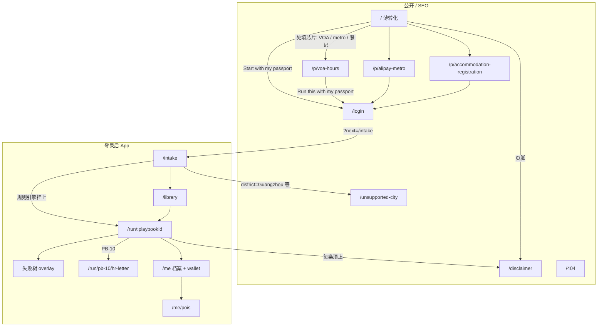
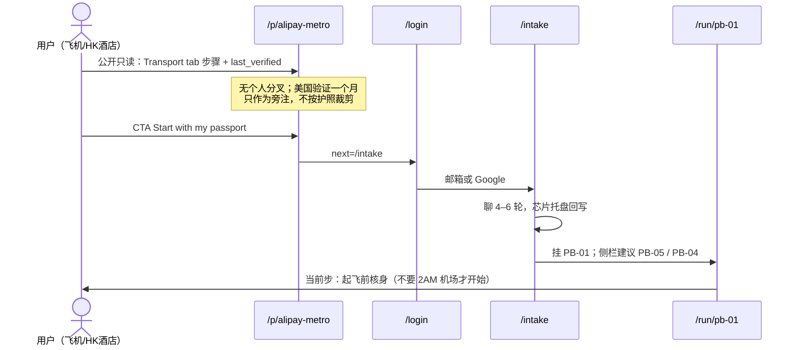
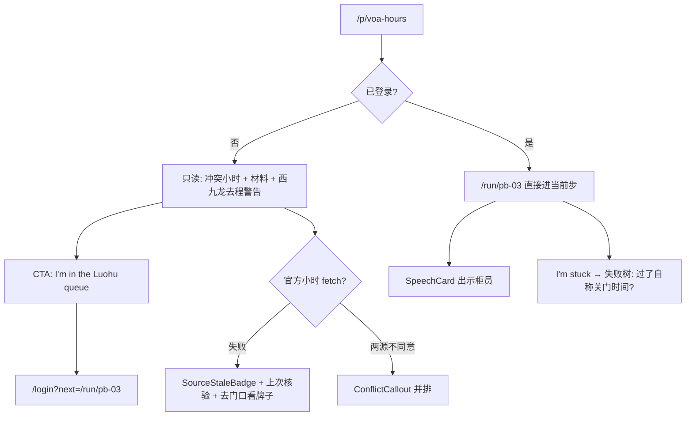

# Shenzhen Copilot v1 界面与信息架构

**工作名：** Shenzhen Copilot  
**文档类型：** V1 UI + IA 规格（界面与信息架构，不是视觉设计系统）  
**日期：** 2026-09-02  
**读者：** 将动手做产品和内容的创始人（中文）  
**权威来源：** `/workspace/shenzhen-copilot-spec.md`（以下简称「产品 spec」）。调研对照：`/workspace/r-shenzhen-research.md`。  
**约束：** 不发明新 playbook、用户 segment 或 GTM。V1 已锁：本周落地的访客 + 抵达 14 天内的搬家者；PB-01 / PB-03 / PB-02 / PB-04 / PB-05 / PB-10；Web app；英文 UI、中文给真实世界；邮箱/Google 登录；无中国手机号、无微信登录、无 RPA 进微信。

**北星：** 宝安体育中心游泳馆帖的信息槽，不是那篇帖的内容。来源：[1srgutv](https://www.reddit.com/r/shenzhen/comments/1srgutv/want_to_swim_at_baoan_stadium_but_dont_speak/)（产品 spec 附录 A / §0 / §8.1）。

---

## 0. 设计原则

每条原则都带产品后果。设计师/工程师拿不准时，用这一节否决，不要靠「感觉像个 App」。

### 0.1 首页不是杂志

产品 spec §0、§8.4：不是生活方式杂志，不是 Internations，不要城市 feed。V1 用户是「本周落地 / 第一周搬家」（§2.6、§11.1），不是来逛蛇口餐厅的。

**后果：** `/` 不做文章流、不做活动日历、不做华强北攻略。首页是一句产品承诺 + 三个当场处境芯片 +「Start with my passport」。SEO 文章形态只活在 `/p/*` 公开 playbook 页（§9.2）。

### 0.2 `last_verified` 永远可见

VOA 办公时间已经在板上打过脸（产品 spec §4.3、§12.1）：窗口自称 6:30–24:00 vs 网上/票务员 17:00。[1ptwzwe](https://www.reddit.com/r/shenzhen/comments/1ptwzwe/shenzhen_5day_visa_on_arrival_tips_and_tricks/)。信任杀手 #1 是过期小时，不是丑的 UI。

**后果：** 公开页、run 页、library 卡片、speech card 全屏、HR PDF 页脚，都必须能读到 SOP 上次核验日期 + 官方 URL。超 14 天（VOA/口岸）或 30 天（SIM/支付路径）出 `SourceStaleBadge`（§6.2）。不允许把日期藏进「About」或只在桌面显示。

### 0.3 护照验证失败是一等公民，不是脚注

游泳馆帖原话：跳过 i深圳/小程序，「nightmare to verify with a foreign passport」。产品 spec §0、§3、§4.4、§8.1：身份模型修不了，策略是绕，文案禁止「我们接入了 i深圳」。

**后果：** 凡步骤依赖小程序/刷脸/外国证件类型灰掉，必须先出 `PassportFailWarning`，再给出窗口或替代入口。这不是 tooltip，是步骤的第 0 屏。失败树里「i深圳刷脸失败」是节点，不是 chatbot 随口一说。

### 0.4 永不嘲讽新手

板上已有：「If you cannot read the information already provided to you, you are going to absolutely struggle in China。」[1ui6rik](https://www.reddit.com/r/shenzhen/comments/1ui6rik/rent_enquiry_apartment/)（产品 spec §1.3.7、§12.1）。产品存在的理由之一就是不像这块板。

**后果：** 禁止「this has been asked」「you will struggle」「just use WeChat like everyone else」。重复问用档案分流静默处理，不显示「你之前问过」。空状态是缺字段，不是责备。L 签开户被拒是预判，不是笑话。

### 0.5 Hybrid：对话只为填档，办成靠 playbook

产品 spec §4、§8.1：不是空白 ChatGPT 框。聊完诊断后，用户主要戳清单。

**后果：** Intake 不是长表，也不是无限聊。桌面右侧（或移动端芯片托盘）始终能看见档案被填上。挂上 playbook 之后，主 CTA 从 Send 变成当前步骤的 checkbox / Next / Show this to the clerk。`I'm stuck` 打开失败树 UI，不打开新会话。

### 0.6 窗口前单手；截图即离线

产品 spec §8：主路径是手机，窗口前单手；§6.4：窗口经常没国际漫游，点击路径要能离线看。不要求装 APK（§8 开篇）。

**后果：** 主 CTA 落在拇指热区。Speech card 有放大/出示柜员模式，对比足够强，截一张图就能用。ClickPath 编号热点印在图上，不依赖悬停。不做「必须在线才能看下一步」的门闩——缓存当前步骤 + 口语卡 + 截图。

### 0.7 只收这一步需要的 PII；官方冲突并排，模型不准选边

产品 spec §4.6、§6.8、§6.10、§12.3：官方互斥 → 并排 +「以窗口当场为准」。Docs wallet 加密是开放问题。默认不把证件图送给模型。

**后果：** Intake 允许「I don't know」区。三字段就能开跑，其余后补。上传护照不是开始的门槛。两个官方小时不一致时出 `ConflictCallout`，禁止合成一句假确定。Reddit 只作「他人踩坑」旁注，标签非法律来源。

---

## 1. Sitemap / IA

### 1.1 首页决策（锁）

**选：`/` = 薄转化页，一跳进 intake；不是营销杂志，也不是直接丢进空白聊天。**

理由（全部来自产品 spec，不另开 GTM）：

1. §8.4 明文禁止首页做成城市杂志 / Internations 式 feed。  
2. §9.2 SEO 已经分配给公开 playbook 页（query 是「shenzhen visa on arrival hours」这类），首页不必再承担文章。  
3. §11.1 用户本周落地或 14 天内搬家——他们有截止日期，没有逛的时间。  
4. §12.3 开放问题已预判游客 SEO 会拖死对话：公开页自助，**登录才允许对话**。所以 `/` 可以深链到 `/p/*`，但个性化分叉必须过登录。  
5. §10 假设 1：P0 公开版无登录可读；登录为了档案和提醒。首页同时服务「先读再决定」和「护照开跑」。

`/start` **301 到** `/intake`，只留一个规范入口，避免两套 intake。

### 1.2 全量 v1 路由

| 路由 | 鉴权 | 目的 | 索引 |
|---|---|---|---|
| `/` | 公开 | 薄转化：一句话 + 处境芯片 + Start with my passport | 可索引 |
| `/p/voa-hours` | 公开 | PB-03 只读 SEO | 可索引 |
| `/p/alipay-metro` | 公开 | PB-05（支付交叉）只读 SEO | 可索引 |
| `/p/accommodation-registration` | 公开 | PB-02 只读 SEO | 可索引 |
| `/login` | 公开 | 邮箱 magic link / Google；`?next=` | noindex |
| `/intake` | 登录 | 短对话 + 可见档案；挂 playbook | noindex |
| `/library` | 登录 | 生命周期分组的 playbook 架 | noindex |
| `/run/:playbookId` | 登录 | 正在执行的 live playbook | noindex |
| `/run/:playbookId/hr-letter` | 登录 | PB-10 双语 PDF 预览；仅 `playbookId=pb-10` 有效 | noindex |
| `/me` | 登录 | 档案 + docs wallet + 提醒开关 | noindex |
| `/me/pois` | 登录 | 已保存的派出所/营业厅/口岸 | noindex |
| `/disclaimer` | 公开 | 法律短页；playbook 顶上还有一句 | 可索引 |
| `/unsupported-city` | 公开 | 用户写了广州/上海等 | noindex |
| `*` → `/404` | 公开 | 未知路径 | noindex |

v1 **不做**独立路由：`/feed`、`/chat`、`/map`、`/wait-times`、`/community`、`/pricing`（付费墙不挡 P0，产品 spec §10、§11.2）。失败树是 `/run/:playbookId` 上的 overlay，不是 `/stuck`。

`:playbookId` v1 枚举：`pb-01` 支付 · `pb-03` VOA · `pb-02` 住宿登记 · `pb-04` SIM · `pb-05` 地铁码 · `pb-10` HR one-pager。公开 slug 与内部 id 刻意不同：SEO 用搜索者的英语，app 用稳定 id。

### 1.3 Sitemap（mermaid）



### 1.4 导航 chrome（全 app 共用）

**移动：** 底栏四项，英文标签——`Home`（`/` 或当前 run 若有未完成）· `Library` · `Me`。进行中的 playbook 在底栏 `Home` 上打小点，不要第五个「Chat」tab。顶栏左：返回；右：`SourceStaleBadge`（若当前上下文有 SOP）。

**桌面：** 顶栏：字标 Shenzhen Copilot · Library · Me · Log out。主体默认 **左档案/步骤列表 + 右执行面**（intake 与 run 都是分栏，产品 spec §8.1）。宽度 < 880px 折叠成移动栈。

**公开页：** 无底栏。顶栏只有字标 + `Log in` + `Start with my passport`。页脚：Disclaimer · last_verified · 官方源。

不在 chrome 放：语言切换（v1 不做九语，§6.9）、城市切换、未读通知红点、积分。

---

## 2. 关键用户流

四条都是 V1 锁死的用户 × playbook，不发明第五条「找朋友」。每条写：入口 URL、逐屏、回写档案哪些字段、挂上哪些 playbook、空/错态。

### 2.A 飞机上 / 香港酒店，没用过产品：「明天落地，美国护照，没有微信支付」

**入口：** 更可能是 SEO `/p/alipay-metro`（query「alipay metro foreigner」，产品 spec §9.2）或朋友私下丢的 `/`。不是 r/shenzhen 帖内链（§9.1 禁止在板上做增长）。

**档案将填写：** `passport_country=US` · `visa_type` 由对话问出（常见 `voa_5` 或 `L`；未知则 `unknown`，不让模型猜）· `arrival_date=明天` · `broken=[payments]` 并可能加 `metro_qr` · `wechat_pay=not_installed` · `alipay` 待问 · `has_cn_phone=false` · `has_cn_bank=false`。区允许 unknown。

**挂上：** PB-01 必挂（支付是 #1 绊脚石，[1t9yeli](https://www.reddit.com/r/shenzhen/comments/1t9yeli/i_live_in_shenzhen_heres_what_actually_works_for/)）。若 `broken` 含地铁或「怎么从口岸进城」→ 并挂 PB-05。若签证=VOA 且人在港 → 并挂 PB-03。无中国号 → 并挂 PB-04（钥匙不是商品，§1.1.5）。**不**挂 PB-10（无雇主 HR）。**不**跑 PB-06 银行全文（L/VOA 开户预判拒绝即可，§6 边界）。



**逐屏：**

1. **公开 SEO 页。** 读 Alipay Transport 路径、外卡能买东西但闸机不行的失败模式（[1vpsd0z](https://www.reddit.com/r/shenzhen/comments/1vpsd0z/buying_metro_tickets_using_wechatalipay_with_data/)）。CTA 主按钮 `Start with my passport`，次按钮 `Log in`。  
2. **Login。** Google 一键或邮箱 magic link。文案写明：不需要中国手机号、不做微信支付。错误：邮件被拦 →「Check spam; we never ask for a mainland number」。  
3. **Intake。** 机器人先问处境芯片（I land tomorrow / I'm already in Shenzhen / I'm at a checkpoint）。用户回「tomorrow, US passport, no WeChat pay」。系统回写芯片，追问签证类型与 Alipay 现状。区：Skip / I don't know。进度条：`3 of ~7 — enough to start payments`。主 CTA 在第 3 个必填后变为 `Start payments playbook`。  
4. **Run PB-01。** 第一步不是「打开微信」，而是「你还在酒店/飞机上：现在做 Alipay 核身，不要等到机场 2AM」（§5 PB-01）。美国验证可能超过一个月 → `ConflictCallout`：有人一个月、有人直连成功，两说并排（§4.4）。`PassportFailWarning` 出现在任何「用小程序」步骤之前。  
5. **建议条。** Run 顶或底：`Also queued: Metro QR · SIM`。点了进 `/run/pb-05`，PB-01 进度保留。

**空/错：** 公开页 fetch 失败 → 仍展示上次人工核验 SOP + 黄标，不空白。Intake 签证选 unknown → 支付树走最保守（同时准备 Tour Pass 旁注与外卡直连，不写死 Alipay 更容易）。用户中途关 VPN 提示（只警告组合，不给方案，§4.4、§7.2）。

### 2.B 人在罗湖，VOA 队里，要营业时间 + 带什么

**入口：** `/p/voa-hours`（query「shenzhen visa on arrival hours」，§9.2）。窗口前单手，可能没登录、可能没漫游。

**档案：** 若登录：`visa_type=voa_5` · `arrival_port=luohu` · `broken=[voa]` · 护照国（资格每次 live fetch，不写死名单，§5 PB-03）。未登录：不写档案，公开页按「通用 VOA 访客」展示，**不做**个人资格判定。

**挂上：** 登录后仅 PB-03。队里不主动挂支付，除非用户点「I also can't pay」。



**逐屏：**

1. **公开页首屏（折线以上）。** 大字：Luohu VOA hours，`last_verified`，`ConflictCallout`（6:30–24:00 vs 17:00）+「verify on the door」。West Kowloon outbound 不行的警告（2025-11 实地，标日期，§5 PB-03、§12.2.2）。What to bring：护照、现金约 130 RMB（标用户报告，未知需 live）、一寸照是否现场拍。**不**放实时排队（§11.6）。  
2. **登录捷径。** `I'm in the Luohu queue` → login → 若档案已有护照国，跳过 intake 直接 `/run/pb-03`。缺护照国则 intake 只问这一个。  
3. **Run：当前步 = 排队 + 窗口。** Getting there：罗湖 VOA 办公室 POI（不是罗湖商场）。Speech card：「你好，我办理口岸签证。」Enlarge。材料 checklist。易漏：单次入境、当天往返即耗尽 → 强制 checkbox「I understand this is single-entry」。  
4. **夜间。** 若本地时间已过两源中较早的关门时间 → 顶栏 callout：「Sources disagree on closing time. If the door is closed, do not invent a workaround. Return when the posted sign says so.」不推荐「改走西九龙」。

**空/错：** Fetch 失败见 §6。资格国名单拉不到 → 不判定「你一定能办」，给官方移民局链接 +「check the board at the office」。未登录用户点个人分叉（「我的护照能不能办」）→ 挡在 login，文案：`Sign in to check against the live country list. We still won't guarantee approval.`

### 2.C 搬家者第一夜：酒店 vs 公寓，24h 登记在倒计时

**入口：** `/` 芯片 `I arrived today` → login → intake；或 SEO `/p/accommodation-registration`。法律硬约束：《出境入境管理法》第 39 条（产品 spec §1.1.3、§5 PB-02）。

**档案：** `arrival_date=今天` · `stay_type=hotel | serviced_apt | private_lease | friend` · `district`（I don't know 允许，但派出所 POI 会弱）· `visa_type` 通常 Z / 已有许可办理中 · `has_employer_hr` 可能 true · `broken=[accommodation_reg]`。

**挂上：** PB-02 **强制置顶**（§4.2：抵达<24h 且非酒店）。酒店：仍挂 PB-02，但走短路径「确认酒店已代登记」，不要假装用户必须自己扫房屋码。公寓/朋友家：完整房屋码路径。Z + HR → 侧栏建议 PB-10，不自动打开 PDF。

**逐屏：**

1. **Intake 关键一问（不可跳过）：** `Tonight: hotel, serviced apartment, private lease, or a friend's place?` 这题决定 fork，比区更先问。  
2. **Timer24h 出现。** 登录后凡 `arrival_date` 已过且 `stay_type≠hotel` 且 PB-02 未标完成 → 全局顶栏倒计时（移动端 sticky）。倒计时不是装饰，是法律。  
3. **Run PB-02。** Getting there：按区派出所；蛇口可指向境外人员管理服务中心（公安授权，效力等同，§5 PB-02）。What to bring：护照、签证页、地址（从租约逐字抄，预填但不提交）。Skip mini-program：i深圳刷脸会失败 → 走微信「深圳公安」或窗口（我们 **不** RPA 进微信）。ClickPath：关注深圳公安 → 政务服务 → 出入境业务 → 境外人员临时住宿登记 → **扫门框房屋码**（手输常失败，强制 checkbox「I will scan the door code, not type the address」）。Speech card 给窗口。  
4. **提醒 opt-in。** PB-02 第一步结束或 `/me`：`Email me at T+12h if this is still open.` 默认不勾。无 SMS（没有中国号，§6.7 邮件先）。从港再入境：档案若记下一次出境，当天再催——v1 用手动「I went to HK today」开关，不做护照章 OCR。  
5. **完成。** 用户勾选 got the stamped slip / PDF。Docs wallet 出现 Upload 入口（可选）。生成物：双语 checklist 可截图。

**空/错：** 区 unknown → POI 列表改「pick a district to see the station」空态，playbook 其他步仍可用。房屋码扫失败 → 失败树：所属派出所 / 蛇口中心，不是再聊一轮。全国线上试点 2026 不含广东（HiShenzhen，需 live 复核，§12.2.3）——若仍真，callout「Do not wait for a national app. Guangdong is not in the pilot.」

### 2.D HR 要 6 个月租约才能办居留 — 生成 one-pager

**入口：** Intake `broken` 含 HR 材料，或 Library 卡片 `HR asked for a 6-month lease`，或 PB-02 完成后的「Need this for HR?」。证据：[1upmequ](https://www.reddit.com/r/shenzhen/comments/1upmequ/serviced_apartment_recommendations_please/)（产品 spec §2.2、§5 PB-10）。

**档案：** `has_employer_hr=true` · `visa_type` 近 Z / work permit · `stay_type` 任意（酒店登记单也成立）· 不强制上传登记 PDF 才能生成。

**挂上：** PB-10 主；深链 PB-02「how to get the stamped slip」。不挂银行、不挂住房 marketplace（v1 out）。

**逐屏：**

1. **Intake / Library → `/run/pb-10`。** 短步骤：确认 HR 要的是租约而不是登记单；确认用户是否已有酒店/派出所回执。  
2. **预览 `/run/pb-10/hr-letter`。** 双语一页。英文给用户，中文封面信给对接人。官方材料清单 URL 摘录 + 链接。评论原句「In no part of the Work Permit / Residence Permit process do they ask to see an accommodation rental contract」标 **非法律来源**，必须并排官方页（§5 PB-10）。语气 gentle，不写「你的 HR 错了」。  
3. **Download PDF / Copy Chinese letter / Share link（需登录）。** 不做「一键发微信给 HR」。  
4. **若还没有登记单。** 预览页黄条：`This letter is stronger with a registration slip. Start PB-02.` 仍允许先下载——HR 可能今天下午要，用户晚上才去派出所。

**空/错：** 官方材料页 fetch 失败 → PDF 仍可生成，但官方摘录区改「link only, quote unavailable」+ stale badge，**禁止**用 Reddit 评论顶替摘录。用户想改成指责语气 → 没有这个开关。

---

## 3. 屏幕规格

约定：UI chrome **英文**。下列「文案」是界面上的英语；中文只出现在 speech card、预填字段、HR 信、PDF。移动优先描述，桌面作差异。

每屏都写：目的、布局、组件、主 CTA、空/载/错/过期、明确不放什么。

### 3.1 公开着陆 / SEO playbook 页

**路由：** `/` · `/p/voa-hours` · `/p/alipay-metro` · `/p/accommodation-registration`

#### 3.1.1 `/` 薄转化

**目的：** 5 秒内让「本周落地 / 第一周」的人进入正确的公开 SOP 或登录后的 intake。不是品牌故事会。

**布局：**

- 移动：一屏内结束。顶：字标。Hero：one-liner（产品 spec §0 的英文压缩，例如 `English playbooks for the Shenzhen counter — payments, VOA, 24h registration.`）。三枚处境芯片。主 CTA。信任条：三条公开 SOP 的 `last_verified`。页脚 disclaimer 一句。  
- 桌面：同样结构，最大宽 720px 居中。不要左杂志右表单。

**处境芯片（锁死，对 V1 用户，不是 GTM 实验）：**

| 芯片英文 | 去向 |
|---|---|
| I land this week · US/EU passport, can't pay | `/p/alipay-metro` 或登录后 intake 预填 `broken=payments` |
| I'm at Luohu / coming from HK for VOA | `/p/voa-hours` |
| I arrived — hotel vs apartment, 24h clock | `/p/accommodation-registration` |

其下文字链：`Start with my passport` → `/login?next=/intake`。

**组件：** 芯片、主 CTA、`CitationFooter` 迷你（三条 SOP 日期）、页脚链 `/disclaimer`。

**主 CTA：** `Start with my passport`。次：处境芯片本身。

**状态：** 加载几乎无（静态）。若信任条日期拉不到，写 `verification time unavailable` 而非藏起来。

**明确不放：** 邻里指南、活动、华强北、语言学校、定价表、App Store 徽章、微信二维码、城市摄影、testimonials 轮播、「Join 10k expats」。

#### 3.1.2 `/p/:slug` 公开只读 playbook

**目的：** 与 HeyShenzhen 文章的差别（§9.2）：页脚有核验日期，点进去能进自己的档案跑决策树。公开页 = 该 playbook 的 **未分叉** 版本。

**公开 vs 登录 run 的硬差别：**

| | 公开 `/p/*` | 登录 `/run/:id` |
|---|---|---|
| 个人分叉（护照国、签证、区、支付现状） | 无。写「typical visitor/mover」 | 有。规则引擎裁剪步骤 |
| VOA 资格国名单 | 链到移民局，不说「你能办」 | live fetch + 用户护照国 → 仍不保证获批 |
| 失败树 | 折叠摘要（WeChat 挂了改 Alipay） | 完整决策树 overlay |
| Speech card | 有，通用句 | 有，可带姓名/地址槽 |
| 提醒、wallet、HR PDF | 无 | 有 |
| 对话 | 无 | 无（对话只在 `/intake`） |

**布局：**

- 移动：标题（H1 = 搜索句，如 `Shenzhen visa on arrival hours`）→ `SourceStaleBadge` + `last_verified` 时刻 → 免责一句 → `ConflictCallout`（若有）→ 北星槽依次：Getting there · What to bring · PassportFailWarning · SpeechCard · ClickPath · 易漏 checkbox（公开页 checkbox **不可持久化**，纯展示「don't skip this」）→ 他人踩坑旁注（Reddit，标非法律）→ CTA 条 sticky。  
- 桌面：主栏 65% 上述；右栏 35% sticky：官方链接列表 + `Start with my passport`。

**组件：** `CitationFooter`、`ConflictCallout`、`PassportFailWarning`、`SpeechCard`、`ClickPath`、`OfficialLink`、`SourceStaleBadge`。

**主 CTA：** `Start with my passport` → login → intake（预填 `broken` 对应该条）。队里场景可用第二 CTA `I'm at the counter — skip chat` → login → 若最少字段已有则直达 `/run/:id`，否则 intake 只补缺的。

**空/载/错/过期：**

- Loading：骨架屏 + 步骤标题已来自静态 YAML，截图位 shimmer。  
- 官方 fetch 失败：静态 SOP 仍在，黄标 `Official page unreachable just now. Showing last verified {datetime}. Confirm at the window.`  
- 过期：`SourceStaleBadge`；不隐藏内容。  
- 缺截图：该槽写 `Photo missing — founder still needs to capture this screen.` 对用户英语可软化为 `Screenshot coming; follow the numbered text for now.` 产品 spec 附录 A：缺图就标缺图，不要用散文顶上。

**明确不放：** 评论区、作者博客气质的第一人称长文、相关文章推荐进住房/学校、分享到微博/朋友圈按钮、付费墙、聊天输入框。

---

### 3.2 Intake（对话 + 表单 hybrid）

**路由：** `/intake`（登录）。`/start` → 这里。

**目的：** 用最少轮次填 `UserProfile`（产品 spec §4.1 / §6.1），让规则引擎挂 playbook。不是咨询，不是陪聊。

**不是长表，也不是空白聊天。** 推荐形态（锁）：

- **桌面：** 左 42% 短对话（气泡 + 回复芯片）；右 58% **活的档案卡**，每答一题就亮一格。档案卡永远可见，用户可直接点格子改，不必靠打字。  
- **移动：** 上：对话；下：**芯片托盘** `ProfileChips` 横滑，高度约 72px，不挡输入。点芯片 = 编辑该字段（sheet）。键盘弹起时托盘收成一条 `US · VOA · tomorrow`。

**必填字段（§4.1）与 UI 问法：**

| 字段 | 问法（英） | Skip |
|---|---|---|
| passport_country | Which passport? 国家搜索 | 不可 skip。可用芯片 US/UK/DE/AU/… + Other |
| visa_type | What visa / entry? | `I don't know yet` → `unknown`（不猜） |
| district | Which district tonight? | **允许 I don't know** |
| arrival_date / arrival_port | When / which port? | 日期可用「today / tomorrow / already here」；口岸可 skip |
| broken | What's broken right now? 多选芯片 | 不可全空；至少一枚 |
| wechat_pay / alipay | 两行状态机芯片 | 可先 skip，支付 playbook 里再填 |
| has_cn_phone / has_cn_bank / has_employer_hr | Yes/No 芯片 | skip = false 保守 |
| stay_type | Hotel / serviced apt / lease / friend | 若 broken 含登记则不可 skip |

对话层是这些字段的自然语言壳。每次回答回写。缺字段不让模型猜签证（§6.1）。

**三字段即可开跑（锁）：** `passport_country` + `broken` +（`visa_type` 或显式 unknown）。其余 later。进度文案：`Enough to start. District and WeChat status can wait.` 主 CTA 此时从灰色变实心 `Start {playbook name}`。

**Skip 逻辑（规则，写死，不靠 LLM）：**

- `visa_type=voa_5` → 不问 HR、不问境内卡（可问支付）。建议 PB-03。  
- `stay_type=hotel` 且 broken 含登记 → PB-02 走短路径，仍问抵达日。  
- `broken` 只有 voa → 压缩支付问题到「optional, for after the stamp」。  
- 用户输入 Guangzhou / Shanghai / Beijing 当作区或城市 → 不写进 Shenzhen district，跳 `/unsupported-city`（可返回改）。  
- `wechat_pay=full_wallet` → PB-01 标 skippable，仍建议 PB-02 若 24h 未完成。

**布局组件：** 对话气泡、回复芯片（预置选项优先于纯文本）、`ProfileChips`、进度 `3 fields · start now`、次链 `I'll fill this in Me later`。

**主 CTA：** 未满 3 字段：禁用，旁边解释缺哪。满 3：`Start {primary playbook}`。同时可 `See all in Library`。

**空/载/错：**

- 空：进来第一句固定，不随机：`Tell me which passport and what is stuck. I'll attach a playbook — this is not a chat with a travel writer.` 下挂三枚处境芯片（与首页同）。  
- Loading：模型填槽时档案格 shimmer；步骤建议未出前不要转圈挡整个屏。  
- 错误：模型超时 → 档案卡仍可手动点选，**降级成纯表单**。文案：`Live assist is slow. Tap the chips — same playbooks.`  
- 用户开始闲聊「best brunch」→ 一句：`We don't do food or nightlife. Payments, VOA, registration, SIM, metro, HR letter.` 不嘲讽。不把社交 P2 提前。

**明确不放：** 中国手机号输入、微信扫码登录、长隐私问卷、头像、自我介绍、语言偏好（锁 English）、地图选点（区用芯片）、文件上传（那是 `/me`）。

---

### 3.3 Playbook run 屏（最重要）

**路由：** `/run/:playbookId`

**目的：** 把游泳馆帖的槽做成引擎。用户在闸机/窗口/App 前单手把一步做完。定性金句目标：「this was the swimming-pool post, but for my case.」（§11.4）

#### 3.3.1 槽 → 组件映射（锁，来自 spec §8.1 + 附录 A）

| 游泳馆帖槽 | UI 组件 | 交互 |
|---|---|---|
| Getting There（1 号线宝体 A 出口、走几分钟） | POI 块：名称、地铁线+出口、步行分钟、深链 Amap 英文若有否则中文名可复制 | 不是内嵌超级地图 |
| What to Bring | 材料清单 checkbox（可勾，本地保存） | 不作为「完成步骤」除非标 required |
| Skip i深圳/小程序 | `PassportFailWarning` | 始终在依赖 App 验证的步骤之前 |
| 窗口中文句子「你好，买一张成人票。」 | `SpeechCard`：汉字 + 拼音 + 英语；Copy；Enlarge for clerk | 截图友好 |
| 自助机：点击购票 → 时段 → 去支付 | `ClickPath`：带编号热点的截图序列 | 可左右滑；离线缓存 |
| 押金手环等易漏步骤 | `StepCheckbox` required=true，不勾不能标 step complete | |

另加产品 spec §4.3 要求的：你现在做的事、官方 URL、fetch 时间、冲突、`I'm stuck`。

#### 3.3.2 布局

**移动（窗口前）：**

```
┌─────────────────────────────┐
│ ←  Pay at the counter       │
│ US · VOA · no WeChat    ⋯   │  ← ProfileChips 压缩
│ last verified 2 Sep 02:09   │  ← 永远可见
├─────────────────────────────┤
│ Step 3 of 7 · Metro QR      │
│ ████████░░░░                │
├─────────────────────────────┤
│ ⚠ PASSPORT WILL FAIL        │
│ Skip the mini-program.      │
│ Open Alipay itself →        │
│ Transport tab.              │
├─────────────────────────────┤
│ GETTING THERE               │
│ 🚇 罗湖站 Exit A · 3 min    │
│ Copy name                   │
├─────────────────────────────┤
│ WHAT TO BRING               │
│ ☐ Passport                  │
│ ☐ Cash backup ¥20 notes     │
├─────────────────────────────┤
│  ┌───────────────────────┐  │
│  │ 你好，我要用支付宝乘车码 │  │
│  │ Nǐ hǎo, wǒ yào yòng…  │  │
│  │ "Hi, I'll use Alipay  │  │
│  │  transit code."       │  │
│  │ [Copy] [Show clerk]   │  │
│  └───────────────────────┘  │
├─────────────────────────────┤
│ 1-2-3 TAP PATH              │
│ [① 首页] [② 出行] [③ 码]    │
├─────────────────────────────┤
│ ☐ I opened Transport, not    │
│   the merchant QR            │  ← required
├─────────────────────────────┤
│ [ I'm stuck ]               │
│ Official · fetched 02:09    │
└─────────────────────────────┘
     [ Home ] [ Library ] [ Me ]
```

**Show clerk 全屏（移动，横/竖都可）：**

```
┌─────────────────────────────┐
│  SHOW THE CLERK        ✕    │
│                             │
│                             │
│   你好，我办理口岸签证。      │
│                             │
│   Nǐ hǎo, wǒ bànlǐ          │
│   kǒu'àn qiānzhèng.         │
│                             │
│   (Visa on arrival.)        │
│                             │
│   Shenzhen Copilot          │
│   not legal advice          │
└─────────────────────────────┘
```

全屏故意去掉底栏、芯片、链接——柜员只应看见汉字。用户可截图这张。对比：黑底白字或白底黑字，字号 ≥ 32px 汉字（见 §6 无障碍）。

**桌面：** 三栏——左：步骤列表（当前高亮、完成打勾、失败标 `stuck`）；中：当前步的槽（同上，ClickPath 可并排两图）；右：档案卡 + `CitationFooter` + 官方链。`I'm stuck` 在中栏底，打开中央 modal 树，不是把右栏换成聊天。

#### 3.3.3 步骤列表行为

- 模型 **不许改顺序**（§6.2）。用户也不能把步骤拖成任意序。  
- 可点已解锁步；未满足前置（例：VOA 资格未核）的步灰，点了给原因。  
- 当前步标题英文短（`Open Alipay Transport`），不要「Chapter 3: Understanding Shenzhen transit culture」。  
- 完成 = 该步所有 `required` checkbox 勾上，或用户显式 `Skip — does not apply`（例：已有完整钱包跳过绑卡）。Skip 要记进 run history 供改进失败树（§8.2）。

#### 3.3.4 主 CTA

依当前步类型变化，同一时间只有一个实心按钮：

| 步类型 | 主 CTA |
|---|---|
| 材料 | `I have these`（勾齐 required 后才亮） |
| 口语 | `Show this to the clerk` |
| 点击路径 | `I did these taps` |
| 失败恢复后 | `Try this instead` |
| 最后一步 | `I finished this at the counter` → 结束页一题（§11.4） |

次按钮永远有：`I'm stuck`。

#### 3.3.5 结束页（run complete）

一题：`Did you finish this at the counter/app without posting on Reddit?` Yes / No / Not yet。这是主指标，不是 NPS。No 不惩罚，可开 `I'm stuck` 把失败节点记下来。不弹分享到社交媒体。可以 `Copy link to this playbook`（私下发给下一个新人，§9.5——不是在板上打广告）。

#### 3.3.6 状态

- **Loading：** YAML SOP 先画结构；截图后到。不要整页 spinner。  
- **Empty（不该发生）：** 未知 `playbookId` → 404。  
- **Error fetch：** 步骤正文仍在；`CitationFooter` 变黄。  
- **Stale：** 顶与脚都有 badge。  
- **Conflict：** `ConflictCallout` 插在小时/金额/「先 Alipay 还是 WeChat」之上。  
- **Offline：** Service worker 缓存当前 playbook 的文本、speech card、ClickPath 图。横幅：`You're offline. Speech card and screenshots still work.` 不能新开 intake。  
- **缺图：** 编号文字路径仍在，图位写 missing。

#### 3.3.7 明确不放

聊天输入（intake 已经结束）、社区评论、柜员评分、实时口岸排队、内嵌高德全屏地图、微信分享条、广告、下一步推荐「学汉语」、自动播放视频。VPN 安装教程。

#### 3.3.8 各 v1 playbook 在 run 屏上的特殊点

**PB-01 支付：** 禁止写死「Alipay 一定更容易」。第一步是起飞前核身。失败树入口密度最高。现金兜底 ¥10/¥20 作为最后节点（商户依法应收现金，支付帖说法）。Never：找朋友绑身份（§4.4、§5 PB-01 Never）。

**PB-03 VOA：** 小时冲突是默认 UI，不是异常。西九龙去程警告在 Getting there 槽。费用 130 RMB 标用户报告。Never：保证获批。

**PB-02 住宿登记：** Timer24h 全局可见。房屋码 vs 手输是 required checkbox。Agent 不提交公安（复制预填字段）。Hotel fork 很短。

**PB-04 SIM：** 先分流「只要数据」vs「要内地号」。营业厅名单 v1 先链龙华/福田官方英文页（§12.2.9），POI 不足时空态是官方链，不编造厅地址。Never：黄牛号。

**PB-05 地铁：** ClickPath 的第一热点必须是 Alipay **本体** Transport tab，不是商户码。复用 PB-01 截图组件（§11.5 周 4–5）。失败：现金购票机、Octopus 自 2023（支付帖，旁注）。

**PB-10：** run 屏很短，主 CTA 很快变成 `Preview the one-pager` → `/run/pb-10/hr-letter`。

---

### 3.4 失败树 overlay

**不是新路由，不是更多聊天。** 从 `/run/:playbookId` 点 `I'm stuck` 打开。产品 spec §4.4：调研里已经长好的树，必须写成代码，不要让模型临场编。

**目的：** 把用户从当前失败节点送到下一跳可执行步（可能跳到另一条 playbook，例如支付失败 → 仍留 PB-01 树内；地铁小程序失败 → 同一 run 替换 ClickPath）。

**布局：**

- 移动：全屏 sheet，从上往下是问题节点，每节点 2–3 个大按钮（不是下拉）。选了就展开下一层，**历史面包屑可回退**。底部：`Back to playbook`。  
- 桌面：modal 宽 560px，同样按钮树。右侧可预览将插入的下一步。

**节点形态（例，来自 §4.4，v1 要实现为数据不是文案灵感）：**

```
WeChat Pay completely dead?
  ├─ Try Alipay instead          → 跳 PB-01 Alipay 枝
  ├─ Add balance (no P2P)        → 说明外号不能转个人
  └─ Do not ask a friend to
     bind their ID               → 死胡同说明，无 CTA 去「找朋友」

Alipay US verification > 1 month?
  ├─ Show both: start before
  │  departure / Tour Pass /
  │  foreign card direct         → ConflictCallout
  └─ Cash + metro ticket machine

Foreign card buys things, metro mini-program fails?
  └─ Open Alipay app → Transport → 乘车码   → 替换 ClickPath

Metro gate still fails?
  ├─ Cash ticket machine
  └─ Octopus (metro since 2023)  → 旁注，非法律

Accommodation typed address fails?
  ├─ Scan door 房屋码
  └─ Police station / Shekou MSCE

i深圳 / 粤省事 face fail?
  └─ WeChat 深圳公安 / window / paper slip
     （不声称打通）
```

**主 CTA：** 每个叶子：`Do this step`（把 run 当前步改成该叶子）或 `This doesn't apply`。

**空/错：** 树数据缺失 → 只给 `OfficialLink` + `Copy speech card`，文案：`We don't have a coded branch for this yet. Do not follow improvised chat.` 不要 fallback 成 GPT。

**明确不放：** 自由输入「describe your error」、人工客服、教 VPN、「飞泰国再办签」类步骤（§5 PB-09 Never，v1 本就没有 PB-09）。

---

### 3.5 Library

**路由：** `/library`（登录）。未登录点 Library → `/login?next=/library`。

**目的：** 按 **生命周期** 浏览，不是按政府部门（§8.2）。让产品 thesis 可见：72h 能活下来，第一周把钥匙串齐，HR 那张纸是搬家者的出口。

**分组（v1 锁）：**

| 组 | 放入 | 说明 |
|---|---|---|
| Landing 72h | PB-03 VOA · PB-01 Payments · PB-05 Metro QR · PB-02 24h registration | 访客+搬家者都会撞 |
| First week | PB-04 SIM · PB-10 HR one-pager | 号与材料 |
| Later | 灰：银行网点材料、住房合同、医院路由、工签清单、口岸时间、12306、驾照、公积金… | **显示但不可跑** |

**Later 的推荐（锁）：** 灰卡片 + 角标 `Later` + 一行 why（例：`Bank playbook needs a site visit list we don't have yet`）。不要锁形让人以为付费墙。不要隐藏——隐藏会让人以为产品只是 VOA 工具。点击灰卡：toast 或 sheet `Not in v1. We won't fake a walkthrough.` 无 Waitlist 病毒。

每张活卡片：英文名、一句触发、`last_verified`、若档案已挂则 `In progress · step 3/7`。

**布局：** 移动单列；桌面 2 列。组标题英文：`Landing 72 hours` / `First week` / `Later`。

**主 CTA：** 卡片本身。没有「Buy premium」。

**空：** 新账号无 in-progress：仍展示全部活卡片，不要空白「你还没有开始」——人是来挑任务的。Loading：卡片骨架。Error：本地 YAML 目录仍可列出，日期可能 stale。

**明确不放：** 政府部门 IA（公安/税务/人社）、搜索框做全站（v1 6 条活的，ctrl-f 够）、社交、完成徽章墙。

---

### 3.6 Profile + docs wallet

**路由：** `/me`。`/me/pois` 见下。

**目的：** 办事档案，不是社交资料（§8.2）。用于预填和提醒。上传不是开始的门槛。

**字段：** 与 §6.1 schema 一一对应，英文标签。每项可编辑。签证 `unknown` 合法。区 `unknown` 合法。支付两行用与 intake 相同的状态机。

**Docs wallet 槽（均可空）：** 护照资料页 · 签证页 · 签证照片 · 住宿登记 PDF/照片。按钮 `Upload` / `Remove`。v1 **不**做证件 OCR 自动填，除非用户点 `Prefill from this page`（§6.10 假设：只在用户触发预填时抽字段）。

**存储（必须在 UI 诚实，开放问题不装已接通）：**

产品 spec §6.10、§12.3：加密是否必须端侧才能让人传护照，是开放问题。UI 因此：

- 上传区上方一句：`v1 stores this so you can prefill forms. Encryption-at-rest vs on-device-only is not decided. Skip uploads until you need prefill.`  
- 两个 radio（实现可先只做其一，但文案不撒谎）：`Keep on this device` / `Save to account (encrypted in transit; server encryption TBD)`。若工程第一期只有服务器明文+HTTPS，**不要画假的「端侧加密」盾**。宁可少上传。  
- 默认不把证件图送给模型供应商——预填按钮旁：`We'll extract fields locally in your session when possible.`

**提醒开关（§3.8 细节）：** `Email me about the 24h registration` 默认关。无电话字段。无微信。WhatsApp 是后期通道（§6.7、§8.3），v1 UI 不画。

**主 CTA：** 无全局保存也可以自动保存字段。Wallet 的 CTA 是 `Upload` 按需。`Log out`。

**空：** 新用户看见空格子和「三个字段就能跑 playbook，证件可后补」。Loading：字段骨架。Error 保存失败：芯片回到上次成功值，toast。

**明确不放：** 头像昵称 bio、关注者、国籍以外的种族、雇主公司名必填、薪资、微信号、中国手机号必填。

#### `/me/pois`

保存过的派出所、VOA 办公室、吃护照的营业厅、（v1 可少）医院国际部。来源：run 里点 `Save this place`。每条：中文名、英文名、出口、复制。空态：`Places appear here after you save them in a playbook. We don't ship a city map.` 不做可浏览的全城目录（那是超级 App）。

---

### 3.7 HR one-pager 预览

**路由：** `/run/pb-10/hr-letter`。未跑 PB-10 直接访问 → 重定向到 `/run/pb-10`。

**目的：** 让用户能「gently tell him he's wrong」（§2.2、§5 PB-10、§12.3）。给 HR 看的是中文信 + 官方摘录，不是 reddit 截图。

**布局：**

- 移动：上工具条 `Download PDF` · `Copy Chinese`；下 A4 预览可 pinch。  
- 桌面：左预览，右「What this does / does not」说明（英文）。

**页内容结构（锁）：**

1. 英文眉：`Procedure note for work- / residence-permit documents — not legal advice.`  
2. 中文短信：礼貌、可转发。不写「你的对接人搞错了」。写「根据公开材料清单，住宿登记证明可用于…请见下列官方链接」。  
3. 官方摘录 + `OfficialLink` + fetch 时间。  
4. 旁注区（小、灰）：社区经验原文，标 `Not a legal source`。  
5. 如何拿到登记单：链到 PB-02。  
6. 页脚 `last_verified` + disclaimer。

**主 CTA：** `Download PDF`。次：`Copy Chinese letter`。

**状态：** 官方摘录失败 → 见流 D。生成中：skeleton A4。不可把用户护照扫描嵌进 PDF，除非他们显式勾 `Attach my registration PDF`（默认不勾）。

**明确不放：** 红章伪造、公司抬头、律师署名、指责语气开关、「100% 获批」。

---

### 3.8 提醒

v1 最小集：邮件，24h 住宿登记（§11.5 周 5–6、§6.7）。无 SMS。无微信模板消息（循环依赖）。

**何时出现 opt-in（三处，同一开关）：**

1. `/intake` 挂上 PB-02 之后，一条非阻塞条：`Email me at T+12h if registration is still open.`  
2. `/run/pb-02` 第一步。  
3. `/me` 提醒区。

默认 **关**。文案说明需要什么：邮箱（登录已有）、抵达时间（档案里有就用，没有则请填）。没有中国号也能开。

**触发：** 抵达后 T+12h 仍未标记 PB-02 complete。从港再入境：v1 用 `/me` 开关 `I re-entered from HK today` 手动，当天再催。不做护照扫描侦测出境。

**邮件内容：** 英文短。链到 `/run/pb-02`。含 `last_verified`。不像营销信。退订一键。

**明确不放：** 短信、电话、微信、推送权限弹窗（Web push 后期）、T 签/狂犬/网签（不在 v1 切片，§11.2–11.3）。

---

### 3.9 其余屏（短规格）

#### `/login`

目的：在微信支付未通时仍能用（§6.10）。按钮：`Continue with Google` · `Email me a link`。一句：`No mainland mobile number. No WeChat login in v1.` 主 CTA 即这两个。错误：Google 弹窗被拦、邮箱无效、magic link 过期（再发）。不放验证码短信、第三方营销登录、Captcha 除非被刷。`?next=` 白名单仅本站路径。

#### `/disclaimer`

产品 spec §7.3 英文短声明全文。Playbook 顶上用同一句缩略。不另写中文法律意见。

#### `/unsupported-city`

用户把区/城市写成广州、上海、北京、杭州等。标题：`This playbook is Shenzhen-only.` 正文：SOP 核验铺不开多城（§11.6）。CTA：`I meant a Shenzhen district` 回 intake。不提供「切换城市」。不嘲「you should have known」。

#### `/404`

英文：`This page isn't a playbook.` CTA：`Home` · `Library`（若已登录）。不要聪明的随机城市冷知识。

#### 结束指标页

见 3.3.5，可做 run 上的 modal，不必独立路由。

---

## 4. 组件库（仅 v1）

不要 40 个设计系统零件。下列 13 个是产品差异；Button/Input/Toast 用原生或现成库，不在此命名。

| 组件 | 关键 props | 何时用 | 何时不用 |
|---|---|---|---|
| **SpeechCard** | `hanzi` `pinyin` `en` `size: inline\|clerk` | 窗口/柜员/需出示手机 | 解释性英文段落 |
| **ClickPath** | `frames[] {src, alt, hotspots[{n,x,y,label_en}]}` `offlineCached` | App/自助机逐步点 | 没有截图时改编号纯文字，仍用同一组件空态 |
| **CitationFooter** | `officialUrl` `fetchedAt` `sopVersion` `redditNotes[]` | 每条 playbook 页脚、PDF 脚 | 营销页英雄区 |
| **ConflictCallout** | `sourceA {claim,url,date}` `sourceB` `resolution: "window"` | 两源不同意（VOA 小时、Alipay vs WeChat 难度、机场开户口径） | 只有一个源；不要用来放意见 |
| **PassportFailWarning** | `surface: miniprogram\|face\|id-type` `bypass: window\|alipay-transport\|paper` | 护照验证会失败的步骤第 0 屏 | 普通提示「可能较慢」 |
| **StepCheckbox** | `required` `label_en` `blocksComplete` | 易漏步骤；房屋码 vs 手输；单次入境理解 | 把每一句散文都变成勾 |
| **ProfileChips** | `fields[]` `editable` `compact` | intake 托盘、run 顶栏、桌面档案卡 | 社交 nametag |
| **Timer24h** | `arrivalAt` `complete` `stayType` | `stay_type≠hotel` 且登记未完成 | 酒店短路径；游客 VOA 5 日（那不是本 timer） |
| **SourceStaleBadge** | `lastVerifiedAt` `thresholdDays` | 14d VOA/口岸；30d SIM/支付 | 装饰「LIVE」绿点（我们没有真·实时） |
| **OfficialLink** | `href` `title_en` `fetchedAt` | 任何引用官方的地方，新开页 | 把 Reddit 链做成 OfficialLink |
| **FailureTree** | `nodes` `onLeafSelect` | I'm stuck overlay | 首页、intake |
| **PoiBlock** | `name_zh` `name_en` `metroLine` `exit` `walkMin` | Getting there 槽 | 全城地图浏览 |
| **DisclaimerStrip** | `variant: short\|page` | playbook 顶、`/disclaimer` | 每条气泡都贴一遍（太噪）；短版一句够 |

**SpeechCard 额外行为：** `Copy` 复制汉字（柜员要看的那种）。`Show clerk` → `size=clerk` 全屏。全屏可截图；提供极简底：产品名 + not legal advice，字极小。

**ClickPath 额外行为：** 热点编号印在图上（①②③），不靠 hover——单手+阳光下窗口。可 pinch。缺图：保留编号和 `label_en`。

---

## 5. 内容 + 语言

**Chrome：** 英语。按钮、导航、错误、步骤标题、badge，全英。不做中文 UI（§11.6），不做九语（§6.9，市外办手册已经九语）。

**生成中文的地方：** SpeechCard 汉字、表单预填值（姓名拼音、地址从租约抄的汉字）、HR 信中文面、VOA 表格字段对照。拼音只给口语卡，不给整页。

**语气：** 冷静、可执行、短。像游泳馆帖，不像 lifestyle newsletter。禁止：`you will struggle in China`、`just learn WeChat`、`this has been asked`、惊叹号堆、emoji 除必要的地铁符号。失败是系统的（护照模型、过期小时），不是用户的笨。

**免责（每条 playbook 顶上，英文短，§7.3）：**  
*This is a procedure guide, not legal, medical, or immigration advice. Rules change. Confirm at the counter. Official sources linked below.*

**错误文案例（3–5，可直接进代码）：**

1. **官方页拉不下：** `We couldn't reach the official page just now. You're seeing the playbook last verified {date, Asia/Shanghai}. Confirm the sign at the window — don't treat us as live.`  
2. **两源冲突：** `Two official or field sources disagree. We will not pick a winner. A: {claim} ({date}). B: {claim} ({date}). Use the door sign.`  
3. **广州等：** `Shenzhen Copilot only verifies procedures in Shenzhen. Guangzhou would be a different SOP. If you meant a Shenzhen district, go back.`  
4. **L 签还想开户：** `On an L visa, a personal mainland account is often refused. We won't run a full bank walkthrough that pretends otherwise. Payments playbook still applies.`  
5. **护照刷脸失败（产品不能修）：** `Foreign-passport face login on i Shenzhen / 粤省事 is not something we can unlock. Next: window, paper slip, or WeChat 深圳公安 — we do not operate those apps for you.`

Speech card 示例（PB-03 窗口，创始人中文审，§12.1）：

- 汉：`你好，我办理口岸签证。`  
- 拼：`Nǐ hǎo, wǒ bànlǐ kǒu'àn qiānzhèng.`  
- 英：`Hello, I'm here for a visa on arrival.`

宁短不「翻译腔长句」。柜员要一眼看完。

---

## 6. 状态与边角

| 边角 | UI 行为 |
|---|---|
| **官方 fetch 失败** | 静态 SOP + `SourceStaleBadge` + 错误文案 1。不空白、不让模型补小时。 |
| **两个官方小时不同意** | `ConflictCallout` 默认展开（尤其 VOA）。Resolution 永远是 window sign。 |
| **用户在广州** | `/unsupported-city`。档案不写 `district=other` 假装能跑深圳派出所。 |
| **已有完整 WeChat 钱包** | PB-01 标 `Does not apply — skip`；Library 仍露出 PB-02（登记与钱包无关）。Intake skip 逻辑见 3.2。 |
| **L 签要银行账户** | 不进入未做的 PB-06 全文。Run 内一张预判卡（错误文案 4）+ 链回 PB-01。不嘲讽、不保证「某网点一定给开」。机场一站式开户：官方 vs HeyShenzhen 口径冲突并排，不当 SLA（§5 PB-06、§12.2.4）。 |
| **夜间 VOA** | 用设备本地时 + 两源小时。若已过较早关门：callout「door may be closed; sources disagree; we have no live queue」。不建议改口岸去西九龙办去程 VOA。 |
| **无障碍** | SpeechCard clerk 模式大字、高对比、可系统放大。主 CTA 在拇指区（移动底 72px 安全）。ClickPath 编号不只靠颜色。不要单靠悬停。不要自动播放声。 |
| **PII 最小** | 三字段开跑。上传可选。预填才抽证件字段。不收集微信号、国内手机、雇主税号。Run history 记失败节点，不记护照图像。 |
| **已在酒店** | Timer24h 不恐吓；PB-02 短路径「ask the desk if they already filed」。 |
| **West Kowloon 意图 + VOA** | Getting there 槽先警告去程不行（2025-11 实地，标日期，live 复核，§12.2.2）。 |
| **eSIM 纯流量 vs 美团** | PB-04 分流；不卖 VPN；陈述部分旅游 eSIM 在境外可访问国际服务（§5 PB-04）。 |
| **用户要实时排队** | 不提供数字。文案：`We don't show live border waits without a stable source.`（§11.6） |

结束页以外，任何时候用户想「问一下随便什么」：没有全局 chat fab。回 Library 或当前失败树。

---

## 7. Out of v1 UI

对照产品 spec §11.3、§11.6、§8.4、§7。界面上直接不画：

- 社区 feed、积分、邀请码、排行榜、评论  
- 微信登录、微信二维码、中国手机号门槛、RPA「帮你点微信」  
- 中文 chrome / 九语切换  
- 地图超级 App、全城 POI 浏览、打车调度  
- 实时口岸等候时间（无稳定源就不要假装）  
- App Store / APK / 小程序作为主产品  
- 住房 marketplace、58 列表、Wellcee 克隆  
- 完整医院挂号、狂犬完整 PB-08（v1 最多支付/登记失败树里一张静态「被抓伤 → 最近公立急诊」卡，§11.3）  
- 开户代办、工签申报端、个税计算器  
- 社交 / 活动日历 / Internations 式首页  
- VPN 教程、黄牛 SIM、找朋友绑支付身份  
- 在 UI 里放 r/shenzhen 发帖引导  

Later 灰卡可以暗示 thesis，但不能点进去冒充 walkthrough。

---

## 8. 建造顺序（映射到屏幕，对齐 spec §11.5）

内容比模型重。下列是界面交付，不是另开产品范围。

| 周 | 屏幕 / 组件 | 完成定义 |
|---|---|---|
| **0–1** | `/login` 邮箱+Google；`/me` 档案字段（无强制上传）；空的 `/run/:id` 渲染器：checklist + `CitationFooter` + `SpeechCard` + 截图槽；`ProfileChips`；`/disclaimer` | 用假 SOP 能点完一步、出示口语卡。还没有真内容。 |
| **1–3** | `/intake` hybrid（对话壳+芯片，三字段开跑）；`/run/pb-01` · `/run/pb-03` · `/run/pb-02` 真 YAML；`PassportFailWarning`；`ClickPath` 人工截图；`ConflictCallout`（VOA 小时先接上）；`FailureTree` 支付+登记+VOA 最小节点；`Timer24h`；`PoiBlock` | 三条 playbook 可按护照/签证 fork。模型只填槽和中英话术，不改步骤序。 |
| **3–4** | `SourceStaleBadge`；`OfficialLink` fetch 时间；VOA/公安页拉不下的错误态；公开页与 run 共用同一 citation 组件 | 信任，不是彩蛋。创始人已去罗湖看门牌时间（附录 C）。 |
| **4–5** | `/run/pb-04` · `/run/pb-05`；ClickPath 复用支付截图；Library 生命周期分组 + Later 灰卡 | 地铁 Transport 路径可离线看。SIM 厅不足则官方链空态。 |
| **5–6** | `/run/pb-10/hr-letter` PDF；`/me` 提醒 opt-in + 邮件 T+12h；`/` 薄转化；`/p/voa-hours` · `/p/alipay-metro` · `/p/accommodation-registration`；`/unsupported-city`；`/404`；结束页一题 | SEO 三页可索引；公开无分叉；登录才对话。 |

这 6 周不做：训练模型、computer-use、微信登录、中文 UI、App Store、社区。

---

## 9. 开放 UI 问题

不重开已锁决策（用户、playbook 包、Web、英文 chrome、无微信登录、hybrid、北星结构、无 App Store）。只留界面层未决：

1. **Docs wallet 存储。** 端侧 only vs 服务器。在加密方案落地前，UI 默认劝 skip 上传（§6.10 / §12.3）。不要画假盾。  
2. **Intake 降级阈值。** 模型慢时立刻变纯芯片表单——多少秒？建议 2s 无填槽则露出「tap chips」。不阻塞 v1。  
3. **`I'm at the counter — skip chat` 要多少字段。** 建议：护照国已知则可直达 run，签证 unknown 仍允许，用最保守 fork。  
4. **Clerk 模式配色。** 白底黑字更像出示证件；黑夜窗口可能反过来。做系统 `prefers-color-scheme` 即可，不必第三主题。  
5. **公开页 checkbox。** 只展示 vs localStorage 记勾。建议 localStorage、不与账号同步，避免未登录用户以为我们存了他们的护照流程。  
6. **HR PDF 是否允许自定义公司名。** 建议 v1 不填公司抬头，减少「看起来像假公文」。  
7. **Service worker 缓存范围。** 至少当前 run 的 speech + 图。是否预缓存全部 6 条，看包体；不阻塞设计。

不要在开放问题里重新讨论：要不要做广州、要不要微信登录、要不要社区、要不要实时排队、homepage 要不要杂志——已经锁。

---

## 附录 D — 公开页 H1（SEO 用搜索者的句子，§9.2）

| 路由 | H1（英） | 对应 playbook |
|---|---|---|
| `/p/voa-hours` | Shenzhen visa on arrival hours | PB-03 |
| `/p/alipay-metro` | Alipay metro for foreigners | PB-05（交叉 PB-01） |
| `/p/accommodation-registration` | Temporary accommodation registration Shenzhen | PB-02 |

不要发明黑话标题如 `The Definitive Expat OS`。

---

## 附录 E — 信息架构自检（做 UI 评审用）

- [ ] 任何有 SOP 的屏幕能在不滚动进页脚的情况下看到 `last_verified` 吗？（移动允许顶栏一行）  
- [ ] 护照会失败的步骤是否先出现 `PassportFailWarning` 再出现 ClickPath？  
- [ ] `I'm stuck` 是否打开树而不是输入框？  
- [ ] 未登录是否完全看不到针对「你的护照」的资格断言？  
- [ ] 首页是否零篇生活方式文章？  
- [ ] SpeechCard 全屏是否能在没网上截一张就能用？  
- [ ] 是否没有任何中国手机号必填？  
- [ ] Later 灰卡是否可见但不可假跑？  
- [ ] 冲突是否并排，模型有没有写「因此以 A 为准」？  
- [ ] 结束页是不是 Reddit 那一题，而不是 NPS？

— 完 —
